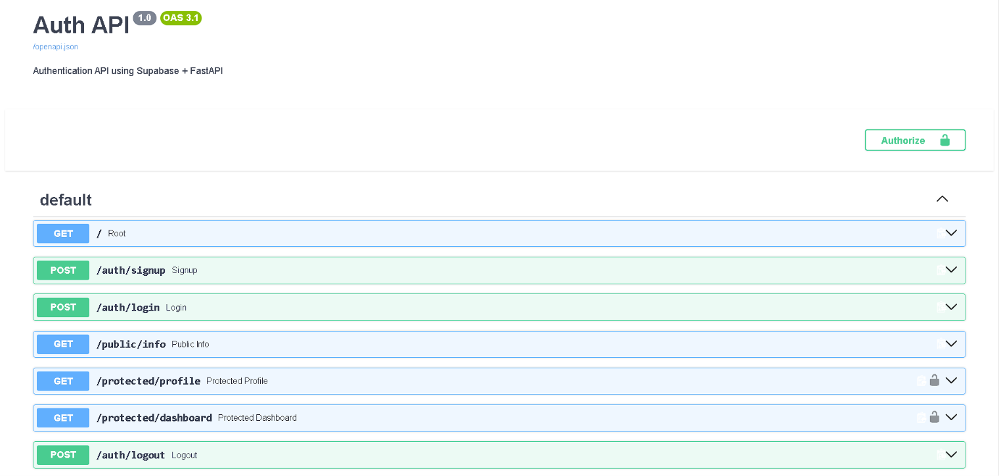

# Week 04 — Auth: Login & Protect

A secure authentication API built with FastAPI and Supabase. 
Handles user signup, login, logout, and protected routes using JWT tokens.

## How to set up

1. Create a free account at [supabase.com](https://supabase.com)
2. Create a new project
3. Go to Project Settings → API and copy your URL and anon key
4. Create a `.env` file in the `week-04/` folder:

SUPABASE_URL=https://yourproject.supabase.co
SUPABASE_KEY=your_anon_key_here


5. Disable email confirmation in Supabase:
   - Authentication → Providers → Email → turn off "Confirm email"

## How to run

```bash
cd week-04
python -m venv venv
venv\Scripts\activate   # Windows
pip install -r requirements.txt
uvicorn main:app --reload
```

Visit `http://localhost:8000/docs` for interactive documentation.

## API Endpoints

| Method | Endpoint | Auth Required | Description | Status Codes |
|--------|----------|:---:|-------------|-------------|
| GET | / | ❌ | Server health check | 200 |
| POST | /auth/signup | ❌ | Create new account | 201, 400 |
| POST | /auth/login | ❌ | Login and get JWT token | 200, 400, 401 |
| POST | /auth/logout | ✅ | Terminate session | 204, 401 |
| GET | /public/info | ❌ | Public information | 200 |
| GET | /protected/profile | ✅ | Get user profile | 200, 401 |
| GET | /protected/dashboard | ✅ | Get user dashboard | 200, 401 |

## How authentication works
POST /auth/signup → create account
POST /auth/login → get access_token
Send token in every protected request:
Authorization: Bearer YOUR_ACCESS_TOKEN
Server verifies token with Supabase
Access granted or 401 returned

## How to test protected routes

1. Login via `POST /auth/login`
2. Copy the `access_token` from the response
3. In Swagger UI click **Authorize** and paste the token
4. Or use curl:
```bash
curl -i http://localhost:8000/protected/profile -H "authorization: Bearer YOUR_TOKEN"
```

## Swagger UI



## Security notes

- `.env` file is gitignored — never commit your Supabase keys
- JWT tokens expire after 1 hour — login again to get a fresh token
- All token verification is handled by Supabase — no custom crypto